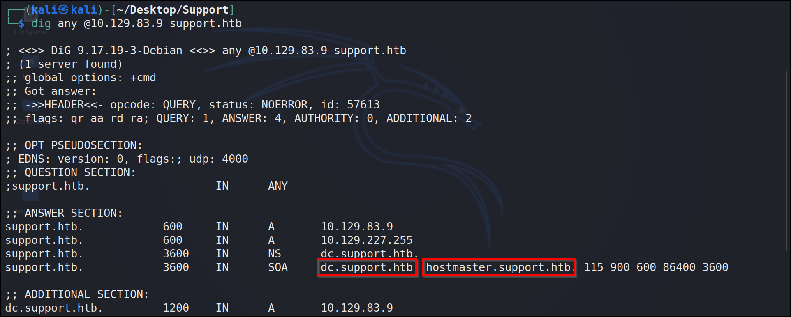
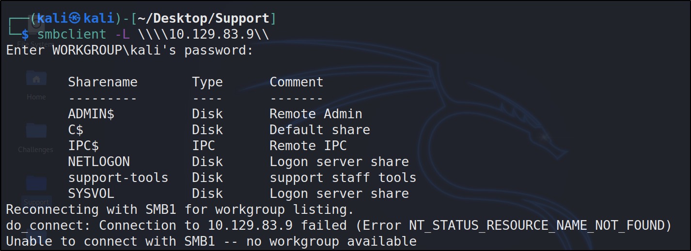
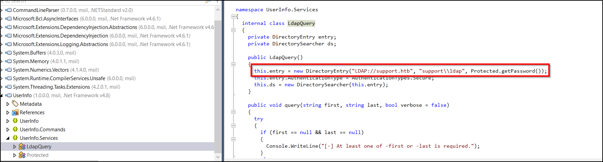
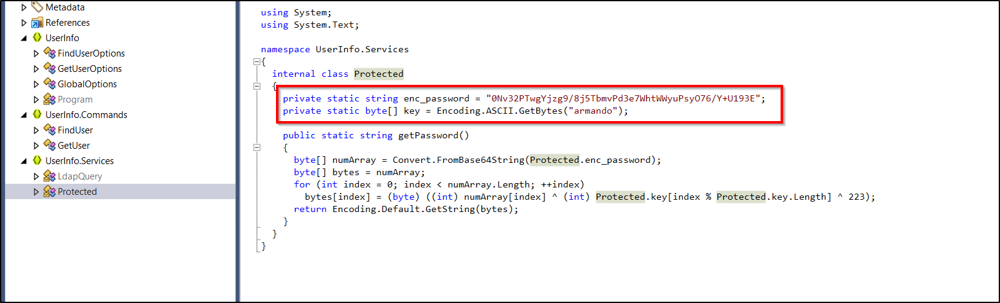
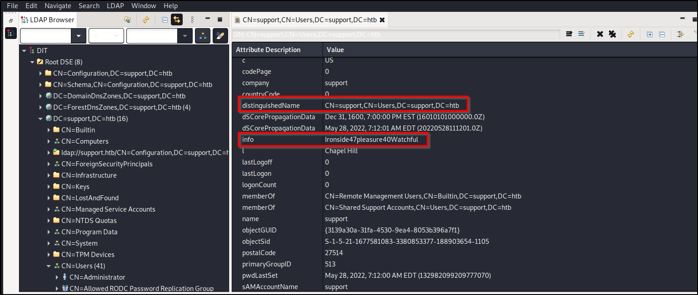
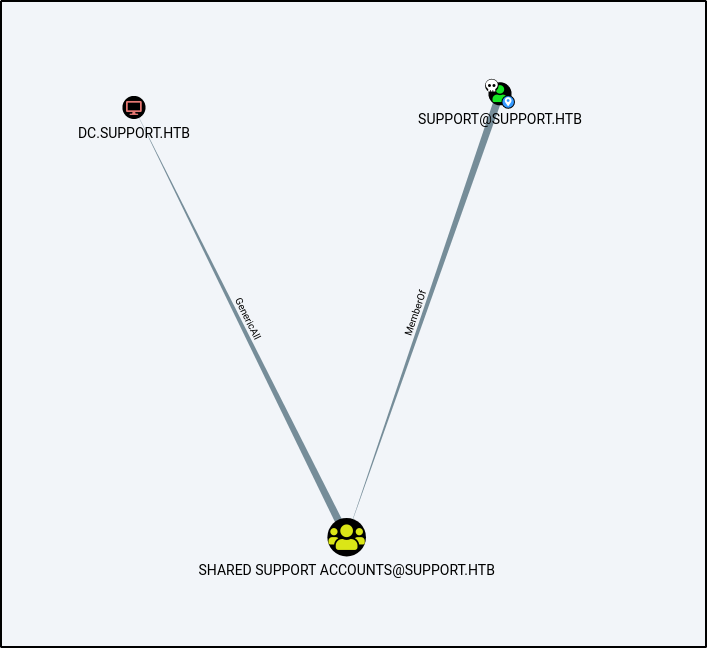

# Support: HackTheBox WriteUP
# Box Info

|-------|---------|
| Name | Support 🚨 |
| OS | Windows 🪟 |
| Rating | Easy |


# Enumeration

An Active Directory box with `support.htb` as Domain.

#### DNS



#### SMB



We can check the available share without any credentials. Inside `support-tools` which is a pubic share had some Windows Executables.

Using **dotPeek** to decompile the executables.



It is sending some LDAP query to the server with `ldap` as username and password is returned from another function.



After running the code got password.

# User

#### LDAP

Enumerating LDAP after getting the credentials using a [graphical Interface](https://book.hacktricks.xyz/network-services-pentesting/pentesting-ldap#graphical-interface)



User `support` had a password in Info attribute. We can LogIn as Remote user in `dc`.

# Privilage Escalation

#### BloodHound

After collecting the Data we can analyse it and define our path.



As our owned user `support` user is a member of `Shared Support Accounts` group which have `Generic All` rights on computer object `DC` .

Reference : [Kerberos Abuse Ired.team](https://www.ired.team/offensive-security-experiments/active-directory-kerberos-abuse/resource-based-constrained-delegation-ad-computer-object-take-over-and-privilged-code-execution)

After repeating all the steps mentioned except the last one since it gets failed.
Use `getST.py` from Impacket.

```shell-session
$ python3 /usr/share/doc/python3-impacket/examples/getST.py -spn www/dc.support.htb -dc-ip 10.10.11.174 -impersonate Administrator support.htb/zoro:123456
```

Then,
```shell-session
$ impacket-psexec support.htb/administrator@dc.support.htb -k -no-pass
```
