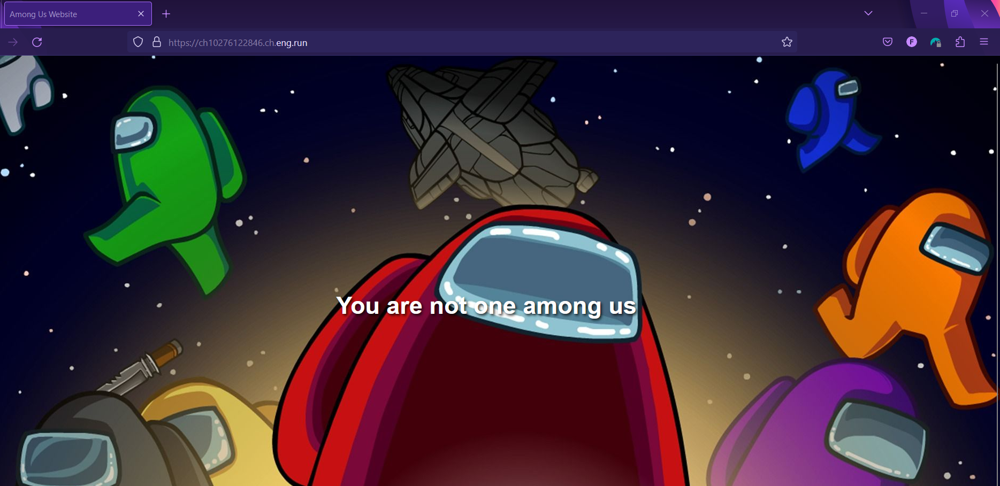
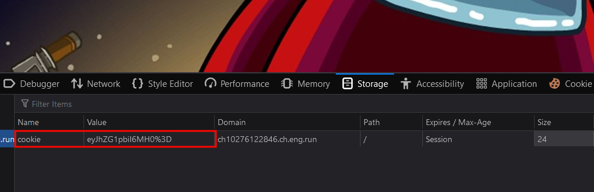
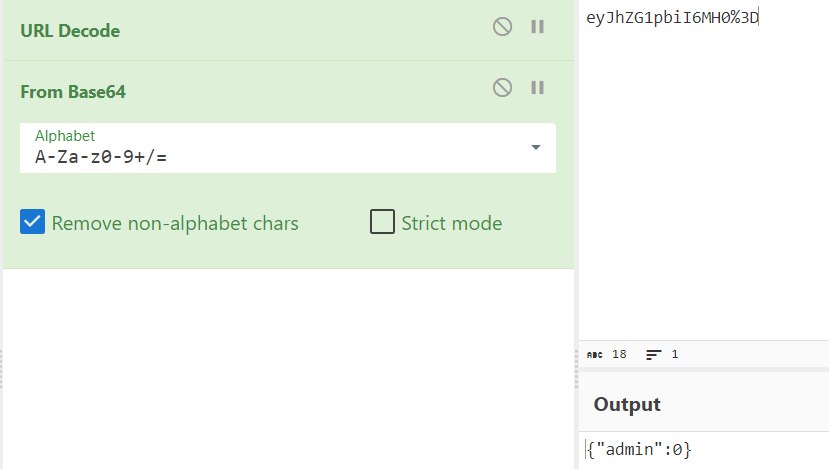
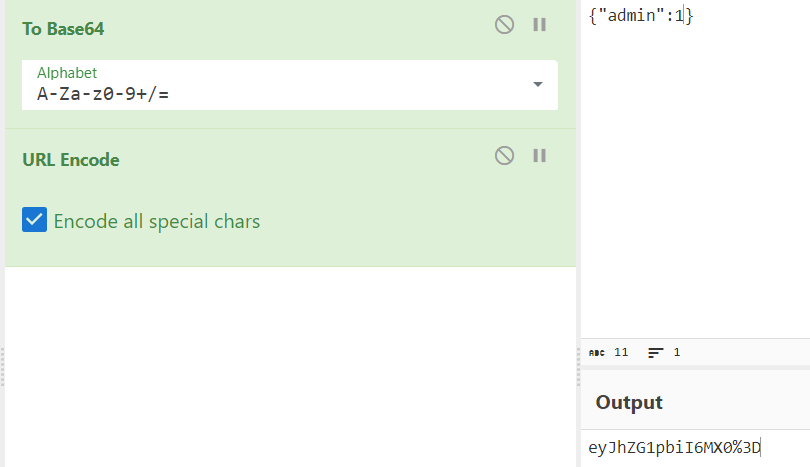
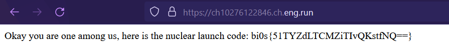

# CookieMonster 🍪
**Digital Defenders Cybersecurity CTF 2023 WriteUp**

Website:

As name of this challenge is suggesting, looking the cookies.

I put the value of `cookie` in [CyberChef](https://cyberchef.org/) and after
- URL Decoding
- Base64 decoding

we can see it just a JSON value.

After modifying the admin value to 1 and encoding it back again. I submitted it in the browser and refreshed the page.

And we can see the FLAG.

