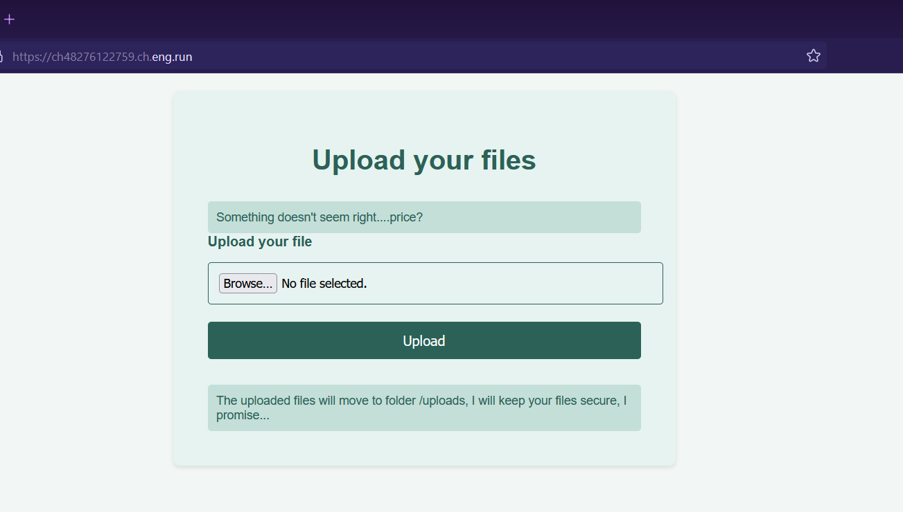
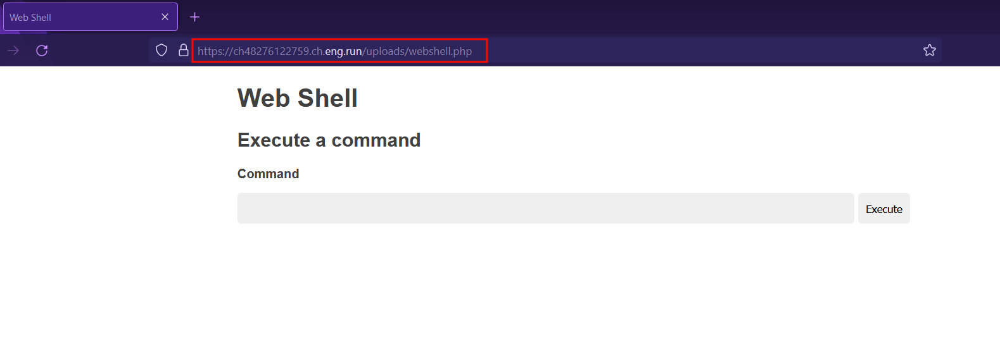
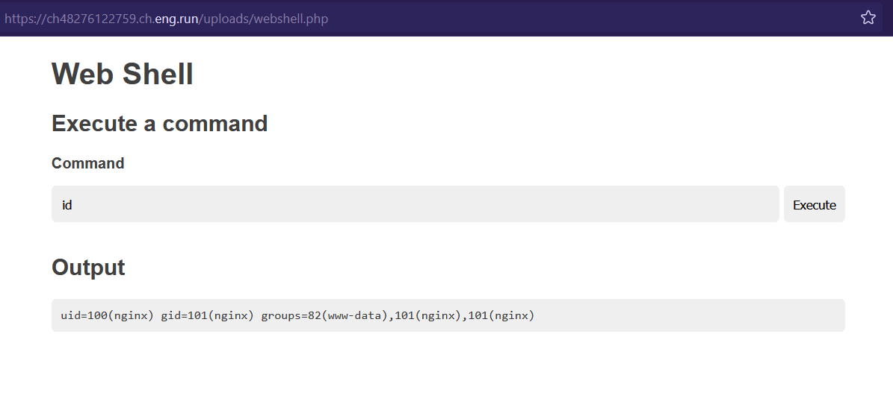
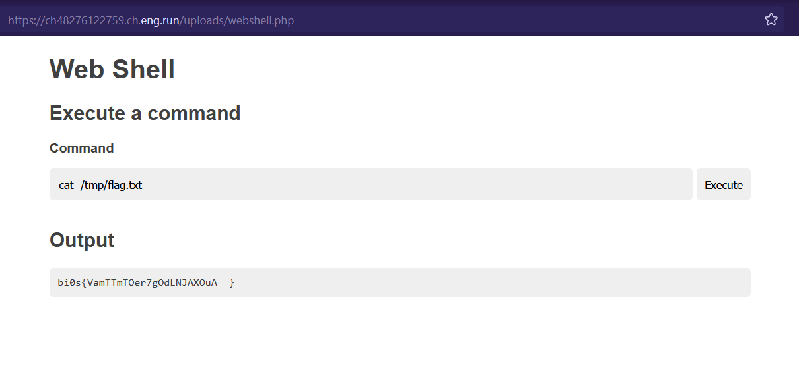

# Ghost 👻
**Digital Defenders Cybersecurity CTF 2023 WriteUp**

**Webpage**:

We can upload our files and it will provide us the URL through which we can access our uploaded our file.
First thing I check was to upload a PHP Web-shell to test whether it have executable write our not.

I uploaded this [artyuum/simple-php-web-shell · GitHub](https://github.com/artyuum/simple-php-web-shell/blob/master/index.php)

And it worked !!.

We can easily run our commands and get the output.

FLAG:

