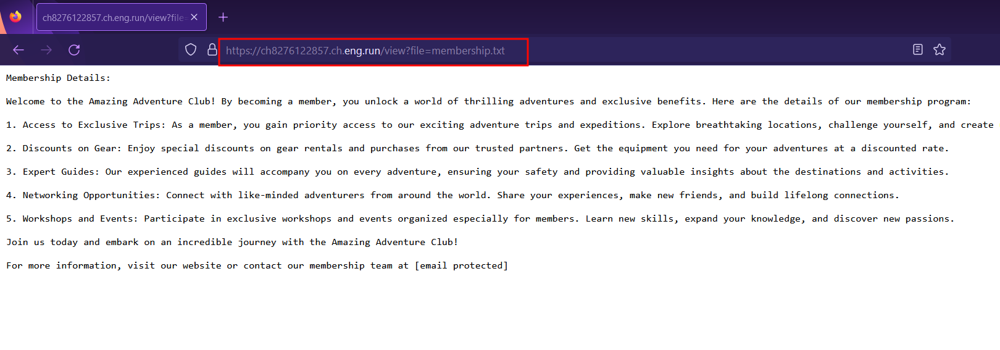
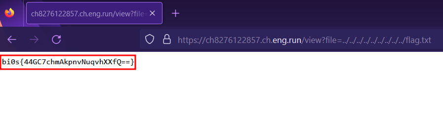

# Laughable File Infiltration 📂
**Digital Defenders Cybersecurity CTF 2023 WriteUp**

Website:

On opening a page we can look at URL and determine that `view` page is loading files locally using value passed in GET parameter `file`. 

Testing **Local File Inclusion** by requesting `/etc/passwd` file.

We got the file. Now we can request for Flag.
