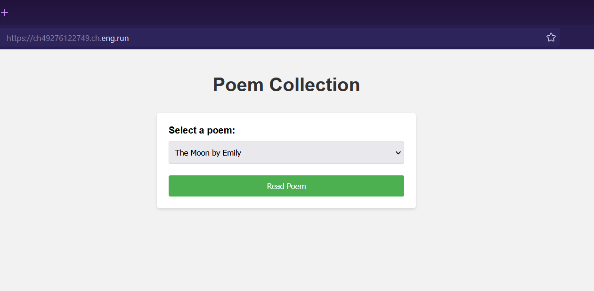
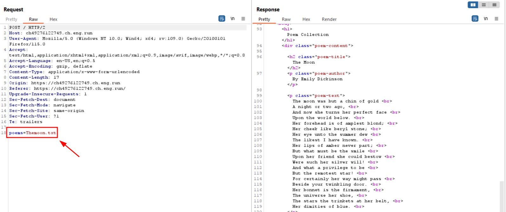
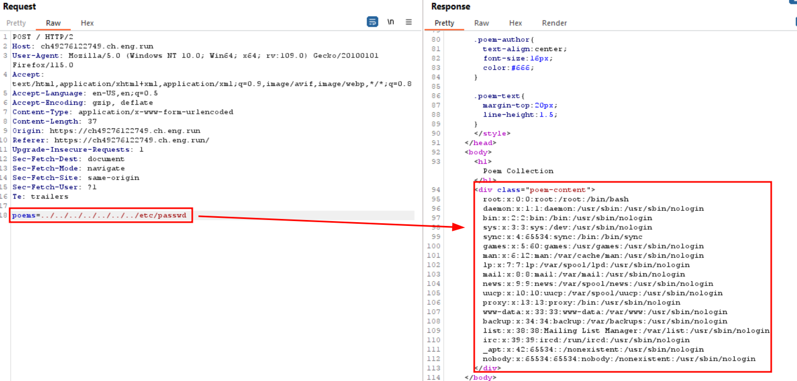
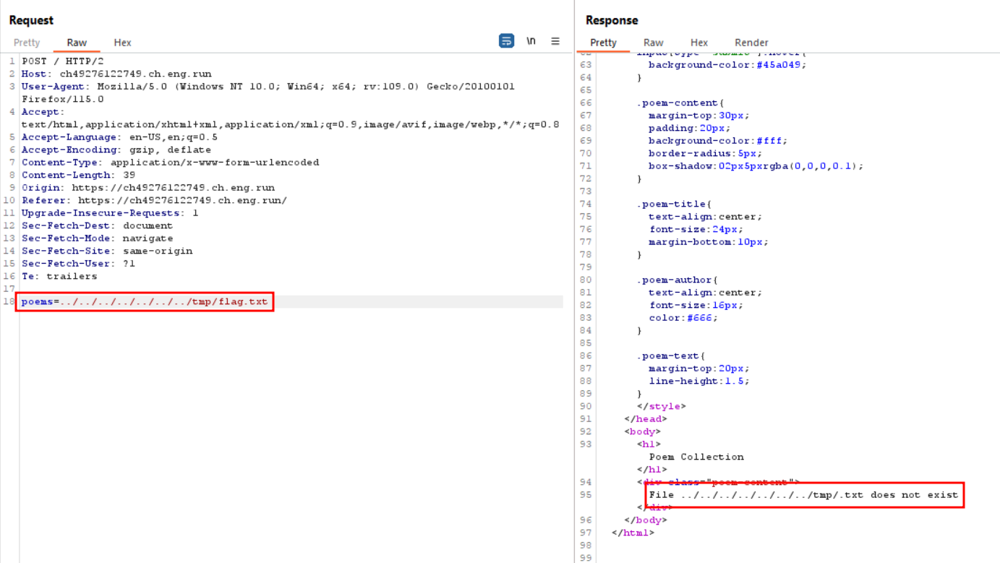
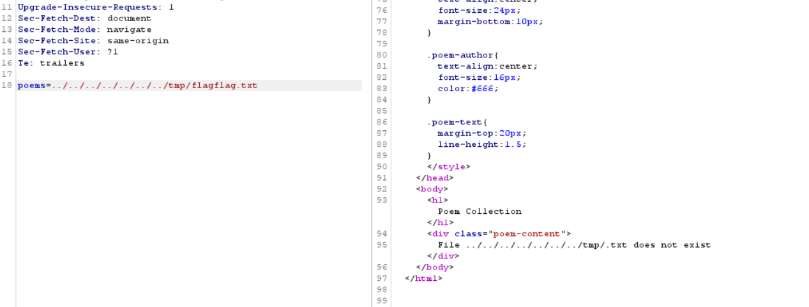
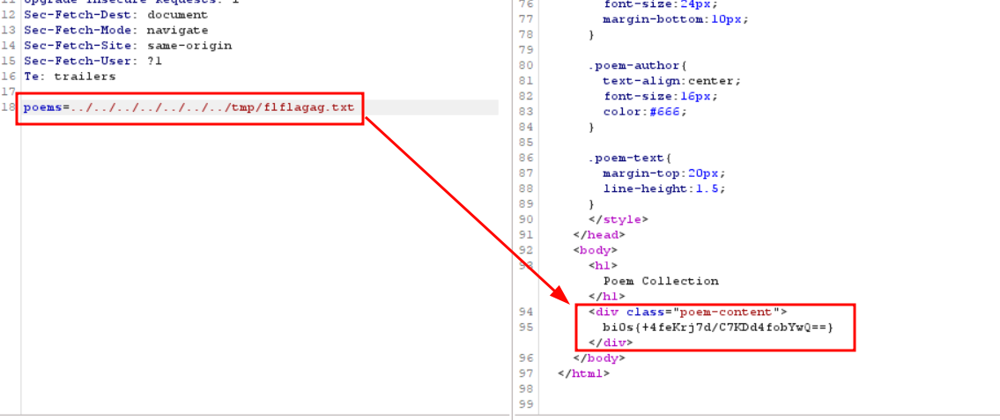

# Laughable File Infiltration 2 📂
**Digital Defenders Cybersecurity CTF 2023 WriteUp**

**Website**:

Intercepting the request using Burp and we can see How a local file is loaded using POST parameter.

Requested for `/etc/passwd` file and we got it back.

On request for `flag.txt`, we are getting the response `.txt` not found ?!!.

There seems to be some kind of filtering which is removing `flag` word from the parameter data.

`flagflag` was also removed.
I am guessing filter goes in one pass and removes `flag` word. So we can bypass it if we pass `flflagag` after filtering it will become `flag` and we can access our FLAG.

It Worked !!!