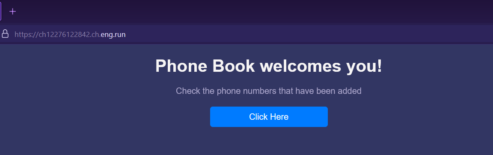
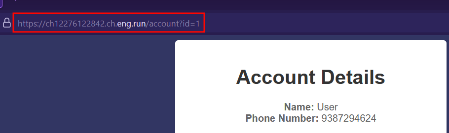
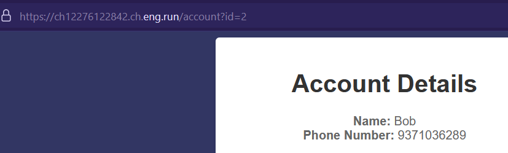

# Phone Book 📞
**Digital Defenders Cybersecurity CTF 2023 WriteUp**

Challenge webpage:

On clicking `Click Here` button we get a Name and Phone Number, but if you look at the URL, the user details which this page is displaying is associated with `id=1`.

On requesting `id=2`, we get some other user's details.

On requesting `id=0` we got the FLAG.
