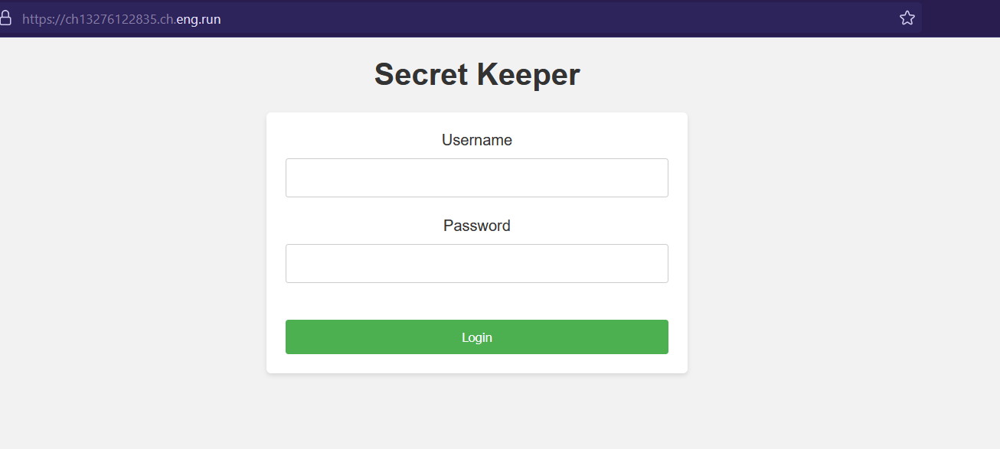
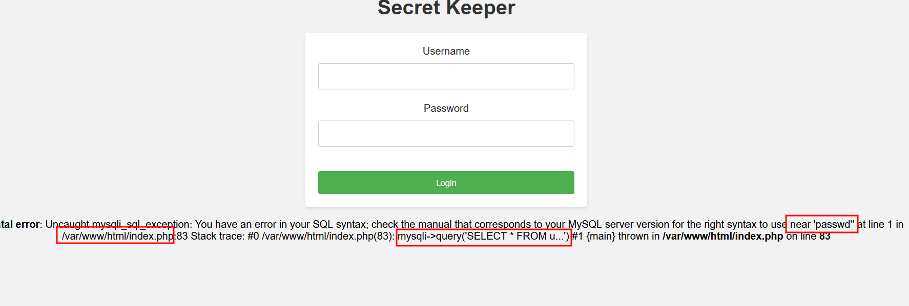
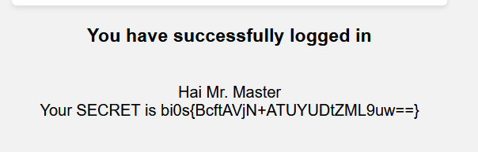

# Secret keeper 🤐
**Digital Defenders Cybersecurity CTF 2023 WriteUp**

Challenge Website:


Testing this payload and see is anything breaks or not. As if our username and password gets directly embeds into the SQL query it will produce some kind of error because of `'`(single quotation mark).

```text
username: admin'
password: anything
```

And it out breaks and produces errors which are directly shown on the webpage. From these errors we can get to know some insights about the backend. 


After some guessing about the query this payload worked and allowed us to bypass the login page and see our FLAG.

```text
username: admin' or '1'='1'-- -
password: anything
```

