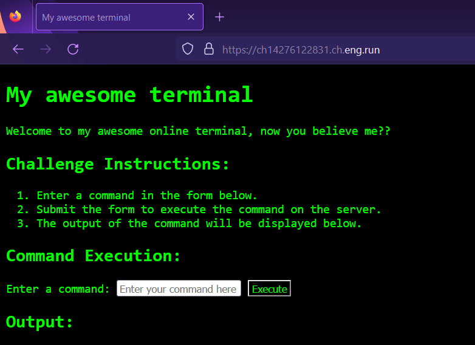
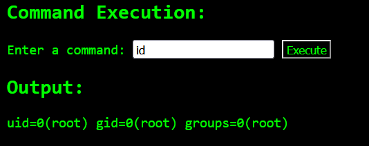
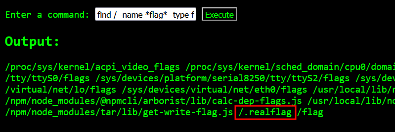
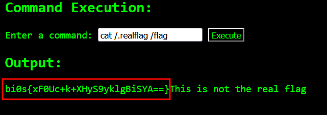

# Shellshocker 🐚
**Digital Defenders Cybersecurity CTF 2023 WriteUp**


Challenge website:


Executing commands and it runs properly.


Finding flag file as it's path was not mentioned in challenge description.

```bash
$ find / -name *flag* -type f 2>/dev/null
```
This command will find any file which have name related to flag and any errors will be redirected to `/dev/null`.

We found two flag related files.


using `cat` to read both files. Seems like one flag file was a decoy.
